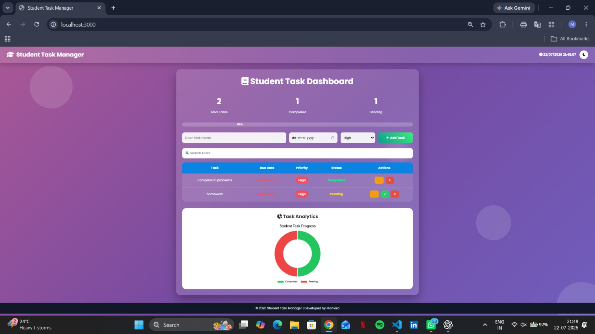
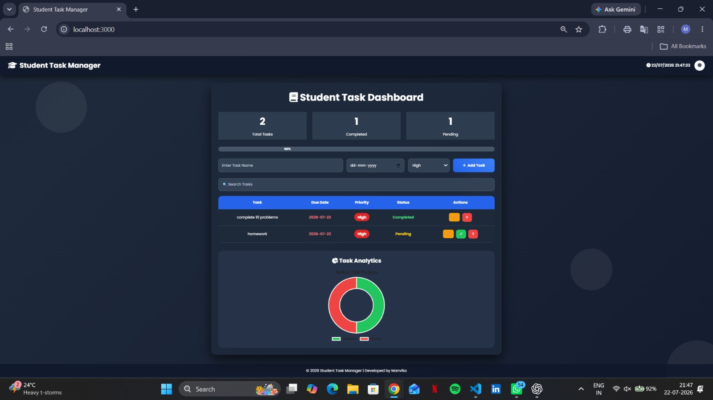
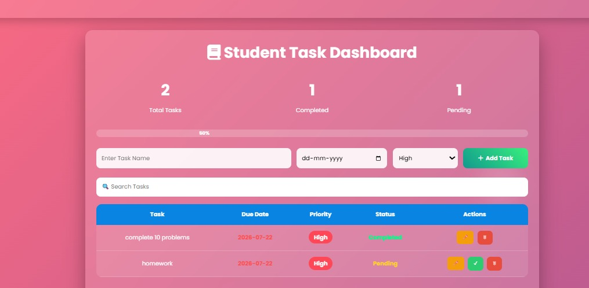
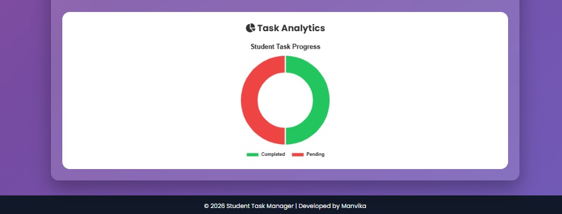

# 📚 Student Task Manager

<p align="center">
  
  
  
  
  
</p>

<p align="center">

## A Modern Full Stack Task Management Web Application for Students

Designed and Developed by **Manvika Bhanothu**

</p>

---

# 📖 Project Overview

Student Task Manager is a modern Full Stack Web Application developed to help students efficiently organize, monitor, and complete their academic and personal tasks.

The application provides a simple yet powerful interface where users can create tasks, edit existing tasks, mark them as completed, delete unwanted tasks, search tasks instantly, and monitor their productivity through an interactive analytics dashboard.

Unlike a simple to-do list, this application provides a complete task management experience with visual progress tracking, priority management, due-date tracking, dark mode support, responsive design, and real-time dashboard analytics.

The backend is developed using **Node.js** and **Express.js**, while the frontend is built using **HTML5**, **CSS3**, and **Vanilla JavaScript**. Task information is stored locally in a JSON file, making the project lightweight and easy to understand for beginners.

---

# 🎯 Objectives

The primary objectives of this project are:

- Develop a complete Full Stack CRUD application.
- Improve task organization for students.
- Demonstrate REST API implementation.
- Learn frontend-backend integration.
- Practice responsive web development.
- Visualize productivity using charts.
- Implement modern UI/UX principles.

---

# ✨ Key Features

## 📌 Task Management

- Add New Tasks
- Edit Existing Tasks
- Delete Tasks
- Mark Tasks as Completed

---

## 📅 Due Date Management

- Select Due Date
- Highlight Expired Tasks
- Display Upcoming Tasks

---

## 🚩 Priority Management

Each task can be assigned one of three priorities:

- 🔴 High
- 🟡 Medium
- 🟢 Low

Priority badges make important tasks easy to identify.

---

## 📊 Dashboard

The dashboard automatically displays:

- Total Tasks
- Completed Tasks
- Pending Tasks
- Progress Percentage

The values update instantly after every operation.

---

## 📈 Analytics

The project uses **Chart.js** to generate a Doughnut Chart that visually represents:

- Completed Tasks
- Pending Tasks

The chart updates automatically whenever tasks change.

---

## 🔍 Search Functionality

Users can instantly search tasks by typing keywords.

The search works in real time without reloading the page.

---

## 🌙 Dark Mode

Supports Light Mode and Dark Mode.

Dark mode preference is automatically saved using Local Storage.

---

## 🎉 Celebration Animation

When all tasks are completed, the application displays a confetti celebration using Canvas Confetti.

---

## 📱 Responsive Design

The application works on:

- Desktop
- Laptop
- Tablet
- Mobile Devices

---

# 🛠 Technology Stack

## Frontend

- HTML5
- CSS3
- JavaScript

## Backend

- Node.js
- Express.js

## Database

- JSON File

## Libraries

- Chart.js
- Font Awesome
- Canvas Confetti

---

# 📂 Folder Structure

```
Student-Task-Manager
│
├── images
│   ├── light-mode.jpeg
│   ├── dark-mode.jpeg
│   ├── dashboard.jpeg
│   ├── analytics.jpeg
│   └── edit-task.jpeg
│
├── public
│   ├── index.html
│   ├── style.css
│   ├── script.js
│   ├── chart.js
│   └── confetti.js
│
├── server.js
├── tasks.json
├── package.json
├── package-lock.json
├── README.md
└── .gitignore
```

---

# 📸 Project Screenshots

## Home Page



---

## Dark Mode



---

## Dashboard



---

## Analytics Chart



---

## Edit Task


---

# ⚙ How It Works

### Step 1

The user enters:

- Task Name
- Due Date
- Priority

and clicks **Add Task**.

---

### Step 2

The frontend sends the task data to the Express server using the Fetch API.

---

### Step 3

The server stores the task inside **tasks.json**.

---

### Step 4

The frontend reloads the updated task list.

---

### Step 5

Dashboard cards and analytics chart update automatically.

---

### Step 6

Users can:

- Edit
- Complete
- Delete

tasks whenever required.

---

# 🚀 Installation

## Clone Repository

```bash
git clone https://github.com/Manvika-04/Student-Task-Manager.git
```

---

## Open Project

```bash
cd Student-Task-Manager
```

---

## Install Packages

```bash
npm install
```

---

## Run Project

```bash
node server.js
```

---

## Open Browser

```
http://localhost:3000
```

---

# 🔄 Application Workflow

```
User
   │
   ▼
Frontend (HTML/CSS/JS)
   │
Fetch API
   │
   ▼
Express Server
   │
Read / Write
   │
tasks.json
   │
   ▼
Updated Dashboard
```

---

# 📚 REST API

| Method | Endpoint | Description |
|----------|-----------|-------------|
| GET | /tasks | Fetch all tasks |
| POST | /tasks | Add new task |
| PUT | /tasks/:id | Update task |
| DELETE | /tasks/:id | Delete task |

---

# 📈 Future Enhancements

- User Authentication
- MongoDB Integration
- Task Categories
- Calendar View
- Email Notifications
- Export PDF
- Excel Export
- Cloud Deployment
- Multiple User Support
- AI-based Task Suggestions

---

# 🎓 Learning Outcomes

Through this project, the following concepts were implemented:

- CRUD Operations
- REST APIs
- Express.js
- Node.js
- Fetch API
- DOM Manipulation
- Responsive Design
- Local Storage
- Chart.js Integration
- JSON Database Handling
- Modern UI Design

---

# 👩‍💻 Author

## **Manvika Bhanothu**

Electronics and Communication Engineering (ECE)

Vardhaman College of Engineering

### GitHub

https://github.com/Manvika-04

### LinkedIn

https://www.linkedin.com/in/bhanothu-manvika-995648290/

---

# 🙏 Acknowledgements

Special thanks to:

- Node.js
- Express.js
- Chart.js
- Font Awesome
- Canvas Confetti

for providing the open-source tools and libraries that made this project possible.

---

# 📄 License

This project is created for educational purposes, portfolio demonstration, and internship submission.

---

# ⭐ If you like this project

Please consider giving this repository a **Star ⭐** on GitHub.

It helps support the project and encourages future improvements.